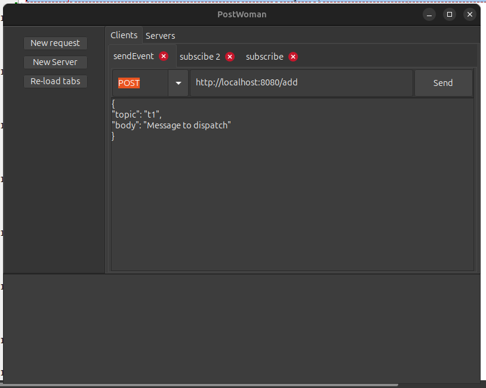

## PostWoman – The HTTP Tester Application

PostWoman is a desktop application that functions as both an HTTP client, similar to Postman, and an HTTP server that displays request headers and body content.

This project is currently in development and is written in Free Pascal (Lazarus).

Todo:
Headers, server response headers

